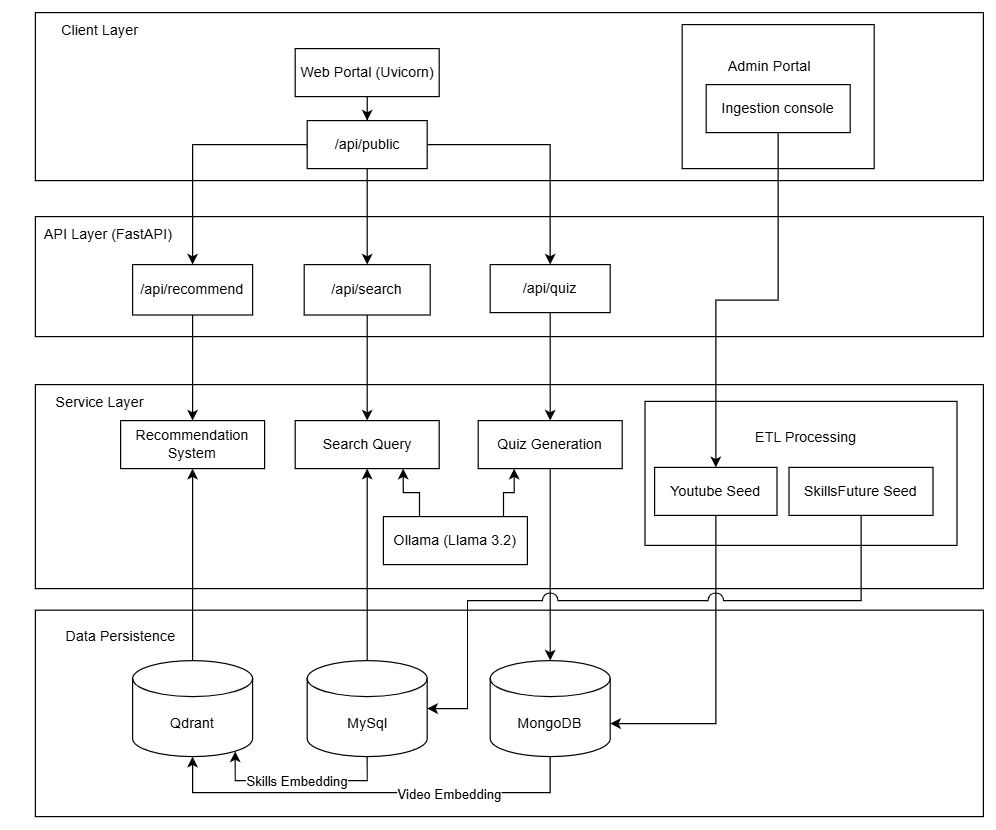

# API Layers Integration Guide

This guide documents the full system boundaries and API-layer integration strategy for teams that need to consume the recommendation engine as an external service.

Intended audience:
- external platform teams integrating by contract only
- internal developers who need the public/internal boundary clarified

Not intended as the main developer onboarding guide for the repo. For local setup and workflow entry points, start with `README.md`.

Purpose of this guide:
- define system boundaries, integration responsibilities, and API usage patterns for cross-team collaboration
- provide architecture-level guidance when a partner team does not have repository access
- reference endpoint-level API contracts in `docs/api_reference.md`

Integration assumptions:
- This project team hosts and operates the recommendation system.
- The partner platform team may not have access to this repository.
- Integration is currently done through HTTP APIs and shared API documentation.
- Explicit API versioning is a recommended next step for production collaboration.

## 1. Integration Objective

Expose recommendation capabilities as stable HTTP APIs so another platform can implement the minimum integration surface:
- discover sectors and skills
- obtain mapped proficiency and competency context
- retrieve personalized recommendations
- search the saved video library semantically without requiring skill or competency context
- submit user feedback (votes)
- optionally trigger content curation workflows

## 2. System Architecture (Layered)

Primary architecture diagram:

Note: this diagram is the primary conceptual view. Use `docs/api_reference.md` as the authoritative endpoint-level contract.

## 3. API Layer Responsibilities

Quick boundary summary:
- `/api/public/*` is the preferred integration surface for partners and frontend clients
- `/api/admin/video-mapping-requests/*` is the admin-only curation surface for review, approval, rejection, unpublish, and reopen actions
- `/api/search/*`, `/api/recommend/*`, and `/api/quiz/*` are engine-level APIs that are available but less integration-stable than the public surface
- `/academy` is the learner demo page, not a platform integration surface

### 3.1 Public Layer (`/api/public/*`)
Purpose:
- Partner-safe contract for UI and platform integration
- Exposes domain-level operations (sector, skill, map, recommend, vote, direct video search, multi-label curation)

Characteristics:
- Input payloads are business-facing (sector/skill/proficiency) or free-text query driven
- Returns curated response payloads ready for frontend consumption
- Includes caching and ranking logic behind the API boundary

Recommended for:
- external product teams
- frontend clients
- partner systems that should not depend on internals

### 3.2 Core Layer (`/api/search/*`, `/api/recommend/*`, `/api/quiz/*`)
Purpose:
- engine-level capabilities and diagnostics
- direct semantic retrieval and quiz generation controls

Characteristics:
- closer to internal data model and retrieval mechanics
- useful for experimentation and quality evaluation

Recommended for:
- internal team and advanced integration users
- model/retrieval QA pipelines
- external teams only when they need lower-level engine behavior not exposed in `/api/public/*`

### 3.3 Page Layer (`/academy`)
Purpose:
- serves local learner demo frontend

Recommended for:
- demonstration only, not platform-to-platform integration

## 4. Data and Dependency Boundaries

### 4.1 Storage Roles

- MySQL:
  - SkillsFuture relational schema and mapping tables
  - source of truth for sectors, skills, proficiency, competency text

- Qdrant:
  - vector indexes for skill and YouTube content retrieval
  - semantic and hybrid candidate retrieval
  - payload metadata for primary/additional video mappings used by filters and boosts
  - required for both the recommendation endpoint and the saved library search mode

- MongoDB:
  - ingested video documents
  - additional video mappings assigned by human curation
  - quiz storage
  - video vote counters

### 4.2 External Dependencies

- YouTube Data API:
  - used by preview/ingest routes and the YouTube mode of the direct video search endpoint
  - constrained by daily quota

- LLM Provider (Groq/OpenAI):
  - used in quiz generation, ingestion query-enhancement, and AI mapping suggestion paths

- Hugging Face model artifacts (embedding and reranker):
  - embedding model is required for semantic search in recommendation and saved library search paths
  - cross-encoder reranker is required for recommendation endpoints, but not for saved library search
  - can be loaded from local cache or downloaded when network access is available

## 5. End-to-End Request Paths

### 5.1 Recommendation path (partner-facing)
1. Partner calls `POST /api/public/recommend/videos`
2. API builds query context from skill/proficiency/competency
3. Retrieval stage executes semantic + BM25 + RRF + metadata boosts
   - proficiency filtering can match either the primary video mapping or `mapped_proficiency_levels` payload
   - competency boosts distinguish primary mapping matches from additional mapping matches
4. Cross-encoder reranks candidate set (embedding/reranker model path)
5. Vote-aware adjustment is applied
6. Top K results returned with metadata

### 5.2 Discovery path
1. `GET /api/public/sectors`
2. `GET /api/public/skills?sector=...`
3. `GET /api/public/skill-map?sector=...&skill=...`

### 5.3 Optional content curation path
1. `POST /api/public/videos/preview`
2. User selects approved videos
3. `POST /api/public/videos/ingest`
4. Videos with complete sector/skill/competency mappings are upserted and indexed for retrieval
5. Videos without mappings are saved as pending mapping review requests and are indexed only after admin approval

### 5.4 Optional multi-label curation path
1. `POST /api/public/multi-label/search-videos`
2. `GET /api/public/multi-label/competencies`
3. `POST /api/public/multi-label/update-video`
4. MongoDB `additional_mappings` are updated and normalized mapping fields are synced to the existing Qdrant payload
5. No video re-embedding is required unless the video has no Qdrant point yet

### 5.5 Direct video search path
This path supports two modes via the same endpoint (`POST /api/public/videos/search`) and does not require sector, skill, or competency context.

**YouTube mode** (`source: "youtube"`):
1. Caller sends a free-text query
2. API calls YouTube Data API and returns fresh candidate videos
3. Videos already present in the saved library are filtered out of the returned candidate list
4. `already_ingested_count` reports saved-library matches detected for the query; returned YouTube candidates have `already_ingested: false`
5. Caller may optionally request a synchronous seeded mapping suggestion with `POST /api/public/videos/suggest-mapping`
6. Caller may select candidates and pass them to `POST /api/public/videos/ingest`
7. Unmapped direct-search submissions are saved as pending admin mapping review requests
8. AI/fallback mapping suggestions are prepared asynchronously after the request is saved
9. Admin approval validates seeded SkillsFuture mappings, writes approved video docs, and indexes Qdrant points
10. Pending rejection creates no embeddings; approved videos must be unpublished to remove MongoDB approved docs and Qdrant points

**Library mode** (`source: "library"`):
1. Caller sends a free-text query
2. API encodes the query using the BGE embedding model
3. Qdrant cosine ANN search retrieves semantic candidates from the saved video index
4. BM25 keyword retrieval runs in parallel over title and tags
5. Reciprocal Rank Fusion merges both candidate sets
6. Title text-match boosting is applied to the top fused candidates
7. Results below the fixed library relevance threshold are excluded
8. Remaining results are returned as view-only library matches with a retrieval `score` field
9. This path does not use the cross-encoder reranker
10. Does not call YouTube API or consume quota

### 5.6 Admin mapping review lifecycle
Admin review requests are stored in MongoDB `videos` documents with `mapping_review.is_request: true`.

State handling:
- `pending`: waiting for admin review. AI suggestions may be `queued`, `running`, `ready`, `failed`, `manual`, or `cancelled`.
- `approved`: approved mapping docs have been written and Qdrant points are live.
- `rejected`: not live. Used as an audit/blocklist record.

Allowed transitions:
- Pending -> approve: validate mapping, write approved docs, index Qdrant.
- Pending -> reject: mark rejected, no Qdrant work.
- Rejected -> reopen: move back to pending for further review.
- Rejected -> approve: allowed after review if the admin wants to restore the video.
- Approved -> unpublish: delete approved MongoDB docs, delete Qdrant points by `video_id`, then mark the request rejected.

Plain reject on an approved request is blocked so the review status cannot disagree with the live Qdrant index.

Library mode requires Qdrant to be running and the YouTube video collection to be populated. Run `python scripts/embed_yt_videos.py` to backfill any videos in MongoDB that have not yet been indexed.

## 6. Integration Without Partner Codebase Access

Use a contract-first collaboration model:

1. API contract package:
- share OpenAPI from `/docs` (when the FastAPI service is running)
- share `docs/api_reference.md`
- track endpoint and schema changes in a changelog

2. Shared test collection:
- provide curl/Postman collection for public endpoints
- include happy-path and error-path examples

3. Environment handoff:
- provide base URL, auth method (if enforced via gateway), and SLA expectations
- provide staging and production endpoint matrix

4. Change management:
- add change log for response schema additions/removals
- agree deprecation window for breaking changes

## 7. Recommended External Integration Contract

Minimal required endpoints for partner launch:
- `GET /api/public/sectors`
- `GET /api/public/skills`
- `GET /api/public/skill-map`
- `POST /api/public/recommend/videos`

Optional engagement endpoints:
- `POST /api/public/videos/{video_id}/vote`
- `GET /api/public/videos/votes`

Optional curation endpoints:
- `POST /api/public/videos/preview`
- `POST /api/public/videos/suggest-mapping`
- `POST /api/public/videos/ingest`
- `GET /api/admin/video-mapping-requests`
- `GET /api/admin/video-mapping-requests/{video_id}`
- `PUT /api/admin/video-mapping-requests/{video_id}`
- `POST /api/admin/video-mapping-requests/{video_id}/approve`
- `POST /api/admin/video-mapping-requests/{video_id}/reject`
- `POST /api/admin/video-mapping-requests/{video_id}/unpublish`
- `POST /api/admin/video-mapping-requests/{video_id}/reopen`

Optional free-text search endpoints:
- `POST /api/public/videos/search` with `source: "youtube"` for fresh YouTube candidate discovery
- `POST /api/public/videos/search` with `source: "library"` for semantic search over the saved video library

## 8. Security and Gateway Recommendations

Current project state:
- no explicit API auth/authorization middleware is configured in `api/main.py`
- intended for standalone demo/local deployment
- admin mapping review endpoints can mutate MongoDB and Qdrant state, so do not expose them publicly without authentication/authorization

For cross-team production integration, place APIs behind a gateway with:
- OAuth2/JWT or signed service token auth
- rate limits by endpoint and partner client ID
- request/response logging with PII redaction
- CORS policy restricted to approved origins
- WAF policy for abuse filtering

## 9. Operational Runbook

### 9.1 Required services
- MySQL
- MongoDB
- Qdrant
- FastAPI app
- optional: ingestion Flask app for manual admin operations (not required for public preview/ingest APIs)

### 9.2 Key environment variables
- database: `DB_*`, `MYSQL_*`, `MONGO_*`
- vector store: `QDRANT_*`, `EMBEDDING_*`
- reranking: `RERANKER_MODEL_NAME`, `PORTAL_RERANK_TOP_N`
- YouTube: `YOUTUBE_API_KEY`, quota settings
- LLM: `LLM_PROVIDER`, `LLM_MODEL`, `LLM_API_KEY`

### 9.3 Health validation checklist
1. FastAPI starts and `/docs` loads
2. `GET /api/public/sectors` returns non-empty list (after SkillsFuture seed)
3. `POST /api/public/recommend/videos` returns results for a known skill (after vector indexes are built)
4. `POST /api/public/videos/search` with `source: "library"` returns results for a known query (after videos are ingested and embedded)
5. vote endpoints can increment and fetch counters
6. optional: preview/ingest flow succeeds with valid YouTube API key

### 9.4 What to check first when debugging

- If public discovery calls fail, confirm MySQL and the SkillsFuture seed are loaded
- If recommendation calls fail, confirm Qdrant is running, collections were created, and embedding/reranker models are available
- If library search returns no results, confirm Qdrant collections exist and `python scripts/embed_yt_videos.py` has been run
- If library search returns a 503, confirm the embedding model is available
- If preview or ingest fails, confirm the YouTube API key and quota state
- If quiz generation or AI mapping suggestions fail, confirm the LLM configuration, MySQL connectivity, and MongoDB connectivity

## 10. API Versioning Guidance

Recommended next step for production collaboration:
- introduce explicit version prefix, for example `/api/v1/public/...`
- freeze response contracts per version
- publish migration notes before contract changes

## 11. Collaboration Handoff Checklist

Before partner implementation starts:
1. Share API docs and OpenAPI export
2. Confirm endpoint ownership and support contacts
3. Provide representative test fixtures and expected result ranges (avoid strict deterministic assertions for ranking/LLM outputs)
4. Align on error handling and retry semantics
5. Finalize release cadence and schema change process

## 12. Related Project Docs

- `docs/api_reference.md`
- `docs/rec.md`
- `docs/youtube_embedding_pipeline.md`
- `docs/vector_index_versioning.md`

This guide plus `docs/api_reference.md` should be treated as the primary integration handoff package.
